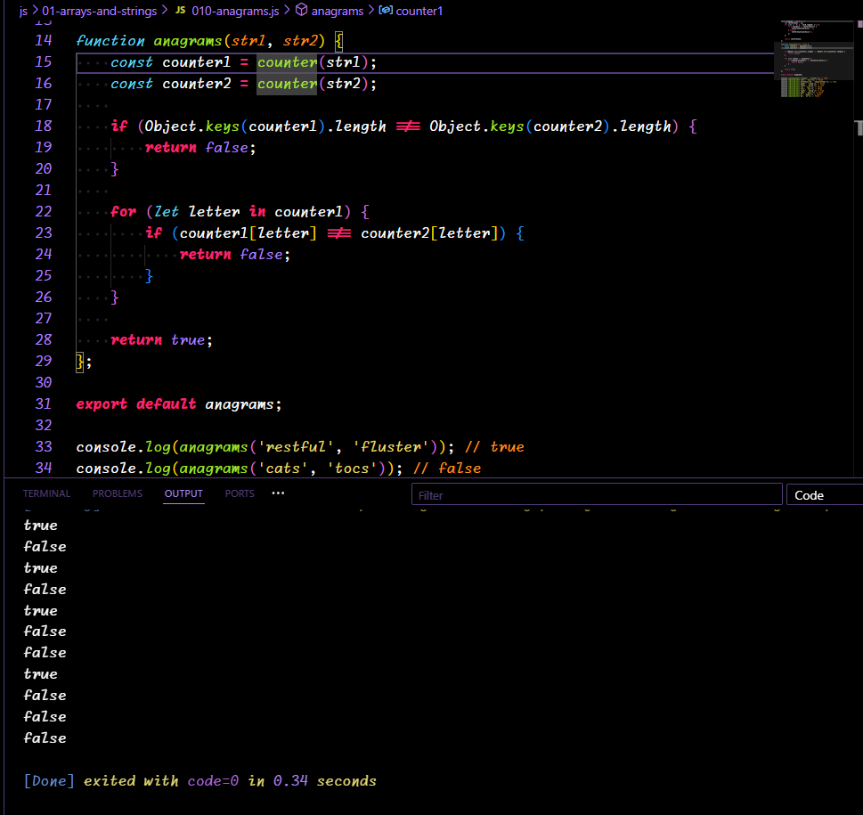
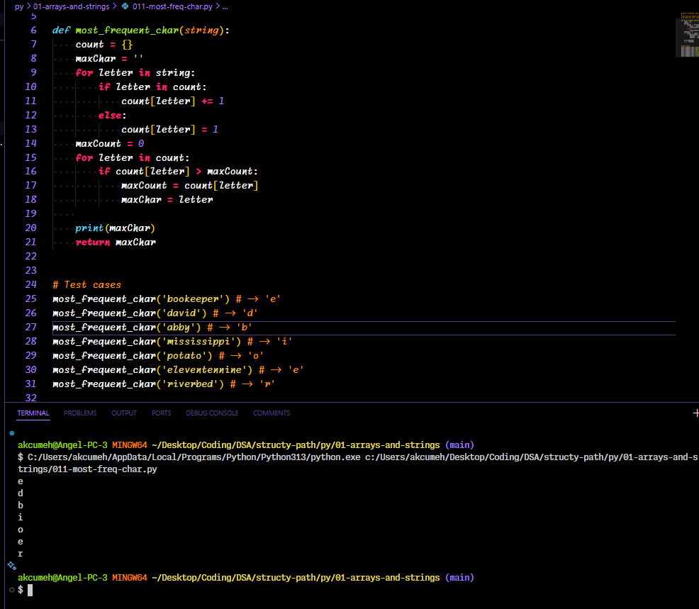
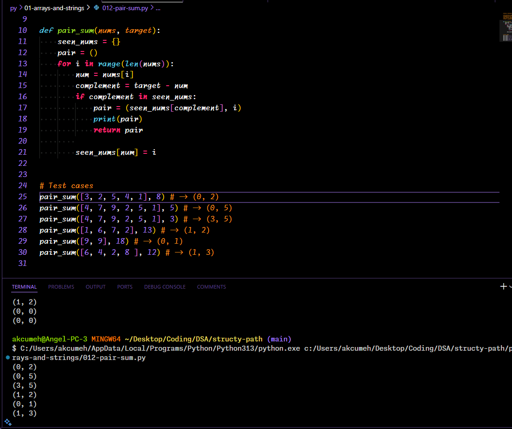
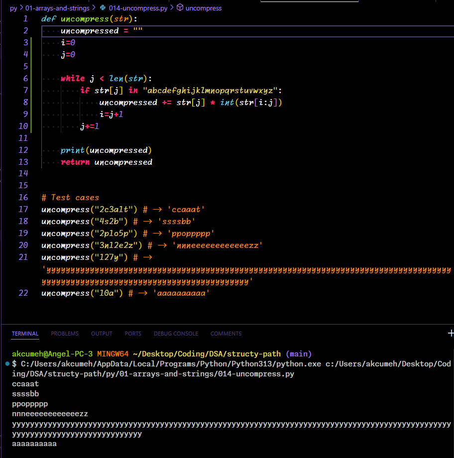
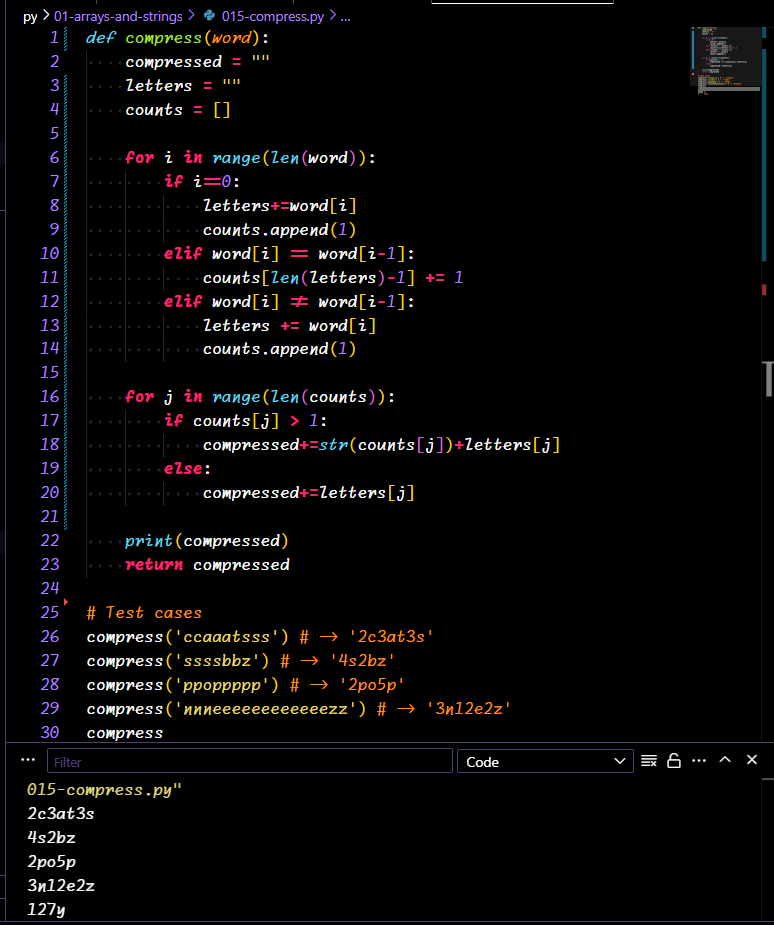

# structy-path
Learning data structures & algorithms on Structy.net

# Table of Contents
## Sections
- [01 - Arrays & Strings](#01---arrays--strings)
- [02 - Beginner Recursion](./*/02-beginner-recursion)
- more sections coming

| Section | Problem | Solution | 
|---------|---------|----------|
| [01 - Arrays & Strings](#01---arrays--strings) | [010-anagrams](#010---anagrams) | [py](./py/01-arrays-and-strings/010-anagrams.py) / [js](./js/01-arrays-and-strings/010-anagrams.js) |
|  | [011-most-freq-char](#011---most-frequent-character) | [py](./py/01-arrays-and-strings/011-most-freq-char.py) / js | 

## 01 - Arrays & Strings

### [010 - anagrams](https://structy.com/problems/anagrams)
#### Problem
Write a function, anagrams, that takes in two strings as arguments.
The function should return a boolean indicating whether or not the strings are anagrams.
Anagrams are strings that contain the same characters, but in any order.

#### Solutions
[Solution - py](./py/01-arrays-and-strings/010-anagrams.py)


[Solution - js](./js/01-arrays-and-strings/010-anagrams.js)



### 011 - most frequent character
#### Problem
Write a function, most_frequent_char that takes in a string as an argument.
The function should return the most frequent character of the string.
If there are ties, return the character that appears earlier in the string.

#### Solutions
[Solution - py](./py/01-arrays-and-strings/011-most-freq-char.py)


### 012 - pair sum
#### Problem
Write a function, pair_sum, that takes in a list and a target sum as args.

The function should return a tuple containing a pair of indices whose elements sum to the given target.
The indices returned must be unique.
Be sure to return the indices, not the elements themselves.
There is guaranteed to be one such pair that sums to the target.

#### Solutions
[Solution - py](./py/01-arrays-and-strings/012-pair-sum.py)


### 013 - pair product
#### Problem
Write a function, pair_product, that takes in a list and a target product as arguments.

The function should return a tuple containing a pair of indices whose elements multiply to the given target. The indices returned must be unique.
Be sure to return the indices, not the elements themselves.
There is guaranteed to be one such pair whose product is the target.

#### Solutions
[Solution - py](./py/01-arrays-and-strings/013-pair-product.py)


### 014 - uncompress
#### Problem
Write a function, uncompress, that takes in a string as an argument. The input string will be formatted into multiple groups according to the following pattern:

```
<number><char>

for example, '2c' or '3a'.
```

The function should return an uncompressed version of the string where each 'char' of a group is repeated 'number' times consecutively. You may assume that the input string is well-formed according to the previously mentioned pattern.

#### Solutions
[Solution - py](./py/01-arrays-and-strings/014-uncompress.py)


### 015 - compress
#### Problem
Write a function, compress, that takes in a string as an argument. The function should return a compressed version of the string where consecutive occurrences of the same characters are compressed into the number of occurrences followed by the character. Single character occurrences should not be changed.

```
'aaa' compresses to '3a'
'cc' compresses to '2c'
't' should remain as 't'
```

You can assume that the input only contains alphabetic characters.

#### Solutions(es?)
[Solution - py](./py/01-arrays-and-strings/015-compress.py)



#### Break in Transmission...
Me when I switch to py for 3 seconds:
