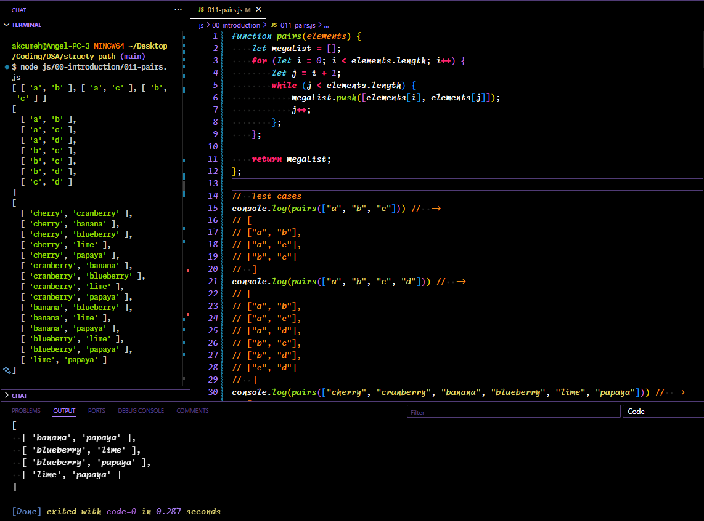

# structy-path
Learning data structures & algorithms on Structy.net

## Table of Contents
| Section | Problem | Solution | 
|---------|---------|----------|
| [00 - Introduction](#00---introduction) | [003-hey-programmer](#003---hey-programmer) | [py](./py/00-introduction/003-hey-programmer.py) / [js](./js/00-introduction/003-hey-programmer.js) |
|  | [004-max-value](#004---max-value) | [py](./py/00-introduction/004-max-value.py) / [js](./js/00-introduction/004-max-value.js) |
|  | [005-longest-word](#005---longest-word) | [py](./py/00-introduction/005-longest-word.py) / [js](./js/00-introduction/005-longest-word.js) |
|  | [006-is-prime](#006---is-prime) | [py](./py/00-introduction/006-is-prime.py) / [js](./js/00-introduction/006-is-prime.js) |
|  | [010-fizz-buzz](#010---fizz-buzz) | [py](./py/00-introduction/010-fizz-buzz.py) / [js](./js/00-introduction/010-fizz-buzz.js) |
|  | [011-pairs](#011---pairs) | [py](./py/00-introduction/011-pairs.py) / [js](./js/00-introduction/011-pairs.js) |
| [01 - Hashing](#01---hashing) | [013-anagrams](#009---anagrams) | [py](./py/01-hashing/013-anagrams.py) / [js](./js/01-hashing/013-anagrams.js) |
|  | [014-most-freq-char](#014---most-frequent-char) | [py](./py/01-hashing/014-most-freq-char.py) / [js](./js/01-hashing/014-most-freq-char.js) | 
|  | [015-pair-sum](#015---pair-sum) | [py](./py/01-hashing/015-pair-sum.py) / [js](./js/01-hashing/015-pair-sum.js) | 
|  | [016-pair-product](#016---pair-product) | [py](./py/01-hashing/016-pair-product.py) / [js](./js/01-hashing/016-pair-product.js) | 
|  | [071-uncompress](#071---uncompress) | [py](./py/01-hashing/071-uncompress.py) / [js](./js/01-hashing/071-uncompress.js) | 
|  | [072-compress](#072---compress) | [py](./py/01-hashing/072-compress.py) / [js](./js/01-hashing/072-compress.js) | 
|  | [017-intersection](#017---intersection) | [py](./py/01-hashing/017-intersection.py) / [js](./js/01-hashing/017-intersection.js) | 
|  | [019-exclusive-items](#019---exclusive-items) | [py](./py/01-hashing/019-exclusive-items.py) / [js](./js/01-hashing/019-exclusive-items.js) | 
|  | [021-all-unique](#019---exclusive-items) | [py](./py/01-hashing/021-all-unique.py) / [js](./js/01-hashing/021-all-unique.js) | 
|  | [022-intersection-with-dupes](#022---intersection-with-duplicates) | [py](./py/01-hashing/022-intersection-with-dupes.py) / [js](./js/01-hashing/022-intersection-with-dupes.js) | 
| [02 - Beginner Recursion](#02---beginner-recursion) | [023-sum-numbers-recursive](#023---sum-numbers-recursive) | [py](./py/02-beginner-recursion/023-sum-numbers-recursive.py) / [js](./js/02-beginner-recursion/023-sum-numbers-recursive.js) | 
|  | [024-factorial](#024---factorial) | [py](./py/02-beginner-recursion/024-factorial.py) / [js](./js/02-beginner-recursion/024-factorial.js) | 

## 00 - Introduction

### [003 - hey programmer](https://structy.net/problems/hey-programmer)
#### Problem
Write a function _greet_ that takes a string argument _s_ and returns the string "hey _s_".

#### Solutions
[Solution - py](./py/00-introduction/003-hey-programmer.py)


[Solution - js](./js/00-introduction/003-hey-programmer.js)


[[Section Top]](#00---introduction)

### [004 - max value](https://structy.net/problems/max-value)
#### Problem
Write a function, _max\_value_, that takes in list of numbers as an argument. The function should return the largest number in the list.

Solve this without using any built-in list methods.

You can assume that the list is non-empty.

#### Solutions
[Solution - py](./py/00-introduction/004-max-value.py)


[Solution - js](./js/00-introduction/004-max-value.js)


[[Section Top]](#00---introduction)

### [005 - longest word](https://structy.net/problems/longest-word)
#### Problem
Write a function, _longest\_word_, that takes in a sentence string as an argument. The function should return the longest word in the sentence. If there is a tie, return the word that occurs later in the sentence.

You can assume that the sentence is non-empty.

#### Solutions
[Solution - py](./py/00-introduction/005-longest-word.py)


[Solution - js](./js/00-introduction/005-longest-word.js)


[[Section Top]](#00---introduction)

### [006 - is prime](https://structy.net/problems/is-prime)
#### Problem
Write a function, _is\_prime_, that takes in a number as an argument. The function should return a boolean indicating whether or not the given number is prime.

A prime number is a number that is only divisible by two distinct numbers: 1 and itself.

For example, 7 is a prime because it is only divisible by 1 and 7. For example, 6 is not a prime because it is divisible by 1, 2, 3, and 6.

You can assume that the input number is a positive integer.

#### Solutions
[Solution - py](./py/00-introduction/006-is-prime.py)


[Solution - js](./js/00-introduction/006-is-prime.js)


[[Section Top]](#00---introduction)

### [010 - fizz buzz](https://structy.net/problems/fizz-buzz)
#### Problem
Write a function, _fizz\_buzz_, that takes in a number n as an argument. The function should return a list containing numbers from 1 to n, replacing certain numbers according to the following rules:

- if the number is divisible by 3, make the element "fizz"
- if the number is divisible by 5, make the element "buzz"
- if the number is divisible by 3 and 5, make the element "fizzbuzz"

#### Solutions
[Solution - py](./py/00-introduction/010-fizz-buzz.py)


[Solution - js](./js/00-introduction/010-fizz-buzz.js)


[[Section Top]](#00---introduction)

### [011 - pairs](https://structy.net/problems/pairs)
#### Problem
Write a function, _pairs_, that takes in a list as an argument. The function should return a list containing all unique pairs of elements.

You may return the pairs in any order and the order of elements within a single pair does not matter.

You can assume that the input list contains unique elements.

#### Solutions
[Solution - py](./py/00-introduction/011-pairs.py)


[Solution - js](./js/00-introduction/011-pairs.js)


[[Section Top]](#00---introduction)

[[Back to Top]](#table-of-contents)


## 01 - Hashing

### [013 - anagrams](https://structy.net/problems/anagrams)
#### Problem
Write a function, anagrams, that takes in two strings as arguments.
The function should return a boolean indicating whether or not the strings are anagrams.
Anagrams are strings that contain the same characters, but in any order.

#### Solutions
[Solution - py](./py/01-hashing/013-anagrams.py)


[Solution - js](./js/01-hashing/013-anagrams.js)


[[Section Top]](#01---hashing)

### [014 - most frequent char](https://structy.net/problems/most-frequent-char)
#### Problem
Write a function, most_frequent_char that takes in a string as an argument.
The function should return the most frequent character of the string.
If there are ties, return the character that appears earlier in the string.

#### Solutions
[Solution - py](./py/01-hashing/014-most-freq-char.py)


[Solution - js](./js/01-hashing/014-most-freq-char.js)


[[Section Top]](#01---hashing)

### [015 - pair sum](https://structy.net/problems/pair-sum)
#### Problem
Write a function, _pair\_sum_, that takes in a list and a target sum as args.

The function should return a tuple containing a pair of indices whose elements sum to the given target.
The indices returned must be unique.
Be sure to return the indices, not the elements themselves.
There is guaranteed to be one such pair that sums to the target.

#### Solutions
[Solution - py](./py/01-hashing/015-pair-sum.py)


[Solution - js](./js/01-hashing/015-pair-sum.js)


[[Section Top]](#01---hashing)

### [016 - pair product](https://structy.net/problems/pair-product)
#### Problem
Write a function, _pair\_product_, that takes in a list and a target product as arguments.

The function should return a tuple containing a pair of indices whose elements multiply to the given target. The indices returned must be unique.
Be sure to return the indices, not the elements themselves.
There is guaranteed to be one such pair whose product is the target.

#### Solutions
[Solution - py](./py/01-hashing/016-pair-product.py)


[Solution - js](./js/01-hashing/016-pair-product.js)


[[Section Top]](#01---hashing)

### [071 - uncompress](https://structy.net/problems/uncompress)
#### Problem
Write a function, uncompress, that takes in a string as an argument. The input string will be formatted into multiple groups according to the following pattern:

```
<number><char>

for example, '2c' or '3a'.
```

The function should return an uncompressed version of the string where each 'char' of a group is repeated 'number' times consecutively. You may assume that the input string is well-formed according to the previously mentioned pattern.

#### Solutions
[Solution - py](./py/01-hashing/071-uncompress.py)


[[Section Top]](#01---hashing)

### [072 - compress](https://structy.net/problems/compress)
#### Problem
Write a function, compress, that takes in a string as an argument. The function should return a compressed version of the string where consecutive occurrences of the same characters are compressed into the number of occurrences followed by the character. Single character occurrences should not be changed.

```
'aaa' compresses to '3a'
'cc' compresses to '2c'
't' should remain as 't'
```

You can assume that the input only contains alphabetic characters.

#### Solutions(es?)
[Solution - py](./py/01-hashing/072-compress.py)


[Solution - js](./js/01-hashing/072-compress.js)


[[Section Top]](#01---hashing)

[[Back to Top]](#table-of-contents)


#### Break in Transmission...
Me when I switch to py for 3 seconds:


### [017 - intersection](https://structy.net/problems/intersection)
#### Problem
Write a function, _intersection_, that takes in two arrays, _a_, _b_, as arguments. The function should return a new array containing elements that are in both of the two arrays.

You may assume that each input array does not contain duplicate elements.

#### Solutions
[Solution - py](./py/01-hashing/017-intersection.py)


[Solution - js](./js/01-hashing/017-intersection.js)


[[Section Top]](#01---hashing)

### [019 - exclusive items](https://structy.net/problems/exclusive-items)
#### Problem
Write a function, _exclusive\_items_, that takes in two lists, _a_, _b_, as arguments. The function should return a new list containing elements that are in either list but not both lists.

You may assume that each input list does not contain duplicate elements.

#### Solutions
[Solution - py](./py/01-hashing/019-exclusive-items.py)


[Solution - js](./js/01-hashing/019-exclusive-items.js)


[[Section Top]](#01---hashing)

### [021 - all unique](https://structy.net/problems/all-unique)
#### Problem
Write a function, _all\_unique_, that takes in a list. The function should return a boolean indicating whether or not the list contains unique items.

#### Solutions
- [Solution - py](./py/01-hashing/021-all-unique.py)
- [Solution - js](./js/01-hashing/021-all-unique.js)


### [022 - intersection with duplicates](https://structy.net/problems/intersection-with-dupes)
#### Problem
Write a function, _all\_unique_, that takes in a list. The function should return a boolean indicating whether or not the list contains unique items.

#### Solutions
- [Solution - py](./py/01-hashing/022-intersection-with-dupes.py)
- [Solution - js](./js/01-hashing/022-intersection-with-dupes.js)


[[Section Top]](#01---hashing)

[[Back to Top]](#table-of-contents)

## 02 - Beginner Recursion
### [023 - sum numbers recursive](https://structy.net/problems/sum-numbers-recursive)
#### Problem
Problem

#### Solutions
[Solution - py]()

[Solution - js]()

[[Section Top]](#02---beginner-recursion)

### [024 - factorial](https://structy.net/problems/factorial)
#### Problem
Problem

#### Solutions
[Solution - py]()

[Solution - js]()

[[Section Top]](#02---beginner-recursion)

[[Back to Top]](#table-of-contents)
